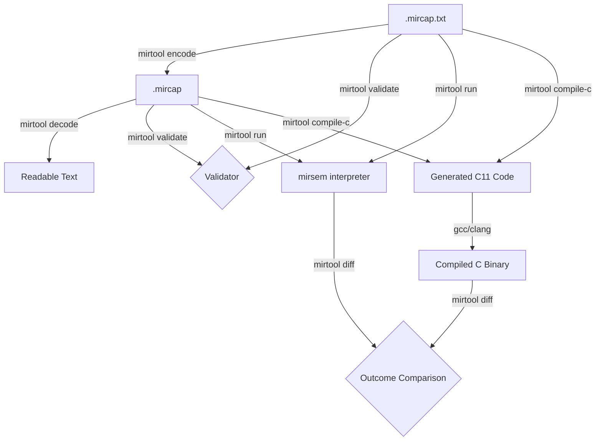

# mirtool

`mirtool` is a developer command-line interface (CLI) for exercising the MIR-F0 experimental rewrite pipeline end-to-end.

> [!NOTE]
> This CLI tool is designed for development and testing purposes. It is not intended for use as a production runtime compiler or interpreter interface.

## 1. The MIR-F0 Pipeline
The pipeline consists of the following components:
1. **Serialization Format (`mircap`)**: Loads/saves either the textual representation (`.mircap.txt`) or the compiled Cap'n Proto binary serialization format (`.mircap`).
2. **Interpreter (`mirsem`)**: Reference semantic interpreter used to execute the module image as a strict oracle.
3. **C Transpiler (`mirc0`)**: Baseline C transpiler that converts the module image to C11 code, allowing comparison of compiled C execution against interpreted `mirsem` outcomes.
4. **CLI Wrapper (`mirtool`)**: Unifies the validator, compiler, interpreter, and differential testing tools into a single developer utility.



---

## 2. File Formats

### Text Format (`.mircap.txt`)
A line-oriented, human-readable format defining the schema name, module metadata, types, symbols, functions, blocks, instructions, operands, and static data segments. Useful for writing tests and inspecting program structure.

### Binary Format (`.mircap`)
The canonical, compiled serialization format of the MIR-F0 bytecode, powered by Cap'n Proto. It uses a flat range-based layout to optimize load times, validation scans, and binary size. It is the intended immutable format for loaded bytecode.

---

## 3. CLI Commands

### `validate`
Loads and validates a module image.
```bash
mirtool validate <input_file> [--format text|binary]
```
Outputs `OK` on success, or `ERROR: <kind>: <message>` on failure.

### `encode`
Encodes textual MIR-F0 into the Cap'n Proto binary format.
```bash
mirtool encode <input_file> <output_file> [--force]
```
If the output file already exists, it will refuse to overwrite it unless `--force` is passed.

### `decode`
Decodes binary MIR-F0 bytecode into a readable debug textual representation.
```bash
mirtool decode <input_file> [--format text|binary]
```
*Note: The decode output is intended for debugging/inspection and is not yet a canonical source format.*

### `run`
Executes the entry function using the `mirsem` interpreter.
```bash
mirtool run <input_file> [--format text|binary] [--entry <name>] [--trace]
```
Outputs the execution results in scriptable format (e.g. `Result: i32 42` or `Trap: 13 OutOfBoundsLoad`). If `--trace` is provided, prints a summary of executed instructions, maximum call depth, and allocator profiling stats.

### `compile-c`
Transpiles the module image into portable C11 code.
```bash
mirtool compile-c <input_file> <output_file> [--format text|binary] [--entry <name>]
```

### `diff`
Runs differential execution checks comparing interpreted execution (`mirsem`) against transpiled C binary execution (compiled via `cc -std=c11 -Wall -Wextra -Werror -O0`).
```bash
mirtool diff <input_file> [--format text|binary] [--entry <name>] [--keep-temp]
```
Outputs `PASS` or `FAIL: <reason>`. Safe temporary files are deleted immediately after execution unless `--keep-temp` is specified.
If no C compiler is available on the host system, the command gracefully reports that compilation was skipped.
