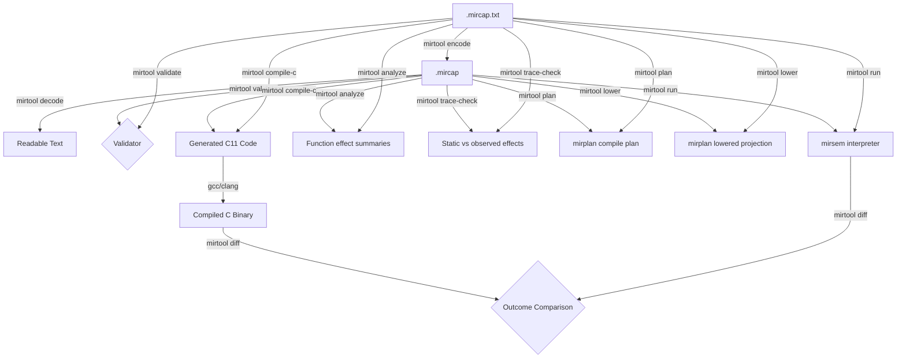

# mirtool

`mirtool` is a developer command-line interface (CLI) for exercising the MIR-F0 experimental rewrite pipeline end-to-end.

> [!NOTE]
> This CLI tool is designed for development and testing purposes. It is not intended for use as a production runtime compiler or interpreter interface.

## 1. The MIR-F0 Pipeline
The pipeline consists of the following components:
1. **Serialization Format (`mircap`)**: Loads/saves either the textual representation (`.mircap.txt`) or the compiled Cap'n Proto binary serialization format (`.mircap`).
2. **Interpreter (`mirsem`)**: Reference semantic interpreter used to execute the module image as a strict oracle.
3. **C Transpiler (`mirc0`)**: Baseline C transpiler that converts the module image to C11 code, allowing comparison of compiled C execution against interpreted `mirsem` outcomes.
4. **Static Analysis (`mirspace`)**: Builds indexed analysis views and conservative per-function effect summaries for reflection-oriented tooling.
5. **Compile Plan (`mirspace` + `mirplan`)**: Builds deterministic planning and lowering artifacts for future compiler work without generating code.
6. **CLI Wrapper (`mirtool`)**: Unifies the validator, compiler, interpreter, analysis, planning, and differential testing tools into a single developer utility.



---

## 2. File Formats

### Text Format (`.mircap.txt`)
A line-oriented, human-readable format defining the schema name, module metadata, types, symbols, functions, blocks, instructions, operands, and static data segments. Useful for writing tests and inspecting program structure.

### Binary Format (`.mircap`)
The canonical, compiled serialization format of the MIR-F0 bytecode, powered by Cap'n Proto. It uses a flat range-based layout to support stable structured loading and faster repeated tool loads. For tiny fixtures, Cap'n Proto framing can be larger than the text fixture; compactness is workload-dependent.

---

## 3. CLI Commands

### `validate`
Loads and validates a module image.
```bash
mirtool validate <input_file> [--format text|binary]
```
Outputs `OK` on success, or `ERROR: <kind>: <message>` on failure.

### `encode`
Encodes textual MIR-F0 into the Cap'n Proto binary format.
```bash
mirtool encode <input_file> <output_file> [--force]
```
If the output file already exists, it will refuse to overwrite it unless `--force` is passed.

### `decode`
Decodes binary MIR-F0 bytecode into a readable debug textual representation.
```bash
mirtool decode <input_file> [--format text|binary]
```
*Note: The decode output is a debug layout intended only for troubleshooting and inspection, and is not a canonical MIR-F0 source format.*

### `run`
Executes the entry function using the `mirsem` interpreter.
```bash
mirtool run <input_file> [--format text|binary] [--entry <name>] [--trace]
```
Outputs the execution results in scriptable format (e.g. `Result: i32 42`, `Result: f32 -16 bits=0xc1800000`, or `Trap: 13 OutOfBoundsLoad`). If `--trace` is provided, prints a summary of executed instructions, maximum call depth, and allocator profiling stats.

### `analyze`
Prints conservative static per-function effect summaries.
```bash
mirtool analyze <input_file> [--format text|binary]
```
Reports allocation, memory reads/writes, trap possibility, direct calls, CFG acyclicity, trivial termination, and pure-candidate status. These are structural summaries for inspection and tests, not full interprocedural proofs.

### `trace-check`
Runs the entry function with `mirsem` and compares observed trace counters with static effect summaries.
```bash
mirtool trace-check <input_file> [--format text|binary] [--entry <name>]
```
Reports the runtime outcome, observed instruction/effect totals, and per-function statuses. `proven-absent` means the static summary ruled out an effect and the run did not observe it; `observed` means a statically possible effect happened; `conservative` means the static summary allowed an effect that this run did not exercise; `mismatch` would indicate a bug in the static summary or trace accounting.

### `plan`
Prints the deterministic MIR-F1 compile-plan text for a module image.
```bash
mirtool plan <input_file> [--format text|binary]
```
This command is read-only. It validates the image, constructs `mirspace::ProgramSpace`, builds a `mirplan::CompilePlan`, and renders it as stable text.

### `lower`
Prints the deterministic MIR-F1 lowered-plan text for a module image.
```bash
mirtool lower <input_file> [--format text|binary]
```
This command is read-only. It validates the image, constructs `mirspace::ProgramSpace`, builds a `mirplan::CompilePlan`, projects it into `mirplan::LoweredProgram`, and renders explicit value reads, value writes, branch targets, direct calls, and memory operations.

### `bench-load`
Measures repeated in-process module loading without repeated file I/O or Cargo startup.
```bash
mirtool bench-load <input_file> [--format text|binary] [--iterations <n>]
```
This command is intended for local demos and rough comparisons between text and Cap'n Proto load paths, not for rigorous benchmarking.

### `compile-c`
Transpiles the module image into portable C11 code.
```bash
mirtool compile-c <input_file> <output_file> [--format text|binary] [--entry <name>]
```

### `diff`
Runs differential execution checks comparing interpreted execution (`mirsem`) against transpiled C binary execution (compiled via `cc -std=c11 -Wall -Wextra -Werror -O0`).
```bash
mirtool diff <input_file> [--format text|binary] [--entry <name>] [--keep-temp]
```
Outputs `PASS` or `FAIL: <reason>`. Safe temporary files are deleted immediately after execution unless `--keep-temp` is specified.
If no C compiler is available on the host system, the command gracefully reports that compilation was skipped.

---

## 4. Build and Runtime Dependencies

### Build-Time Dependencies
* **Cap'n Proto Compiler (`capnp` on PATH)**: Building `mirtool` transitively compiles the `mircap` crate. `mircap` compiles `/schema/mircap.capnp` at build time using a custom `build.rs` script, which requires the `capnp` schema compiler binary to be present on the host system `PATH`.

### Runtime Dependencies
* **Host C Compiler (`cc`, `gcc`, or `clang`)**: A host C compiler is required at runtime **only** when performing differential execution checks (using the `diff` command) or compiling generated C output for testing. Other commands (`validate`, `encode`, `decode`, `run`, `compile-c`) have no runtime dependency on a C compiler.
* **Graceful Degradation**: If no C compiler is available, `diff` will gracefully report that the host compiler is unavailable and skip the compilation/execution phase without failing the command.
